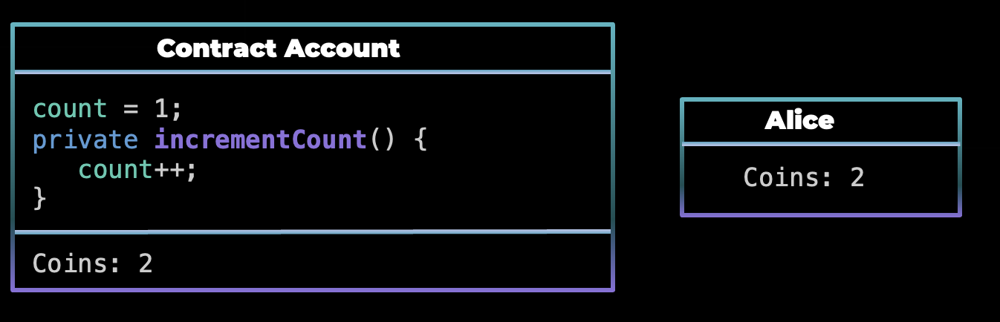
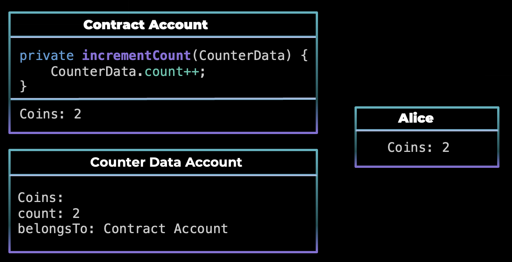

# TicTacToe in 3 Smart Contracts Paradigms 🧩

- [TicTacToe in 3 Smart Contracts Paradigms 🧩](#tictactoe-in-3-smart-contracts-paradigms---)
  * [Introduction 👋](#introduction---)
  * [Smart Contract Paradigms 📗](#smart-contract-paradigms---)
    + [Account-Based Paradigm](#account-based-paradigm)
      - [Stateful Contracts](#stateful-contracts)
      - [Stateless Contracts](#stateless-contracts)
    + [UTXO Based Paradigm](#utxo-based-paradigm)
      - [Witness Constrains](#witness-constrains)
  * [Parallelizability](#parallelizability)
  * [Tic Tac Toe in the Stateful Paradigm 🧩](#tic-tac-toe-in-the-stateful-paradigm---)
  * [Tic Tac Toe in the Stateless Paradigm 🧩](#tic-tac-toe-in-the-stateless-paradigm---)
  * [Tic Tac Toe in the UTXO Paradigm 🧩](#tic-tac-toe-in-the-utxo-paradigm---)
  * [Contributing 🙌](#contributing---)
  * [Acknowledgments 🙏](#acknowledgments---)
  * [License 📜](#license---)

## Introduction 👋

Hello, in this repository, we explore the three fundamental smart contract paradigms: 
- UTXO-based
- Account-Based 
    - Stateless
    - Stateful

The aim of this project is to provide a comprehensive understanding of these smart contract paradigms and their real-world implications. By scaffolding a familiar game (Tic Tac Toe) in each paradigm, we offer practical insights into the differences, challenges, and advantages of each approach.

⁣⭕❕⭕❕❌ <br>
➖➕➖➕➖ <br>
⭕❕⁣❌❕⭕ <br>
➖➕➖➕➖ <br>
❌❕❌❕⭕ <br>

So we will provide an overview of the Tic Tac Toe game implemented in those three different smart contract paradigms. Each implementation serves as a practical demonstration of how these paradigms handle state, transitions, and logic execution.

> Don't worry, we won't bore you with a tutorial on how to play Tic Tac Toe – we trust that you've all mastered it during those 'productive' school days when lessons just couldn't compete with this classic game. 😉

## Smart Contract Paradigms 📗

Smart contracts are self-executing, immutable pieces of code that automate and enforce the execution of predefined agreements on a blockchain. These agreements can range from simple transactions to complex decentralized applications (DApps). To better understand the implementations in this project, let's explore three primary smart contract paradigms:

### Account-Based Paradigm

The Account-Based paradigm, exemplified by [Ethereum](https://ethereum.org/en/) and many other blockchain platforms, operates differently from the UTXO model.

In this paradigm:

- **State Management**: accounts maintain balances and can execute code. These accounts can be externally owned accounts, controlled by private keys, or contract accounts, controlled by the code of a smart contract.
- **State Transitions**: contracts are executed by sending transactions to their respective addresses. Contracts can store and modify their own state, which is maintained on the blockchain.
- **Flexibility**: account-based systems are highly flexible and can accommodate complex smart contract logic.

Within the Account-Based paradigm, we can further categorize smart contracts into two main types: Stateless and Stateful contracts.

#### Stateful Contracts

Stateful contracts are contracts that maintain and manage their own state. They can store data, update it based on transactions, and execute complex logic.
Stateful contracts are suitable for applications that require persistent storage and complex business logic, such as games, decentralized finance (DeFi) platforms, and more.

Think of a stateful contract like a bank account. In a bank account, you have a balance, and you can perform various transactions like depositing money, withdrawing money, or checking your balance. The bank account itself maintains the state, which is your balance. When you deposit money, the balance increases, and when you withdraw money, the balance decreases. The bank account doesn't rely on external systems to track your balance; it manages it internally.

Similarly, in a stateful smart contracts, the contract itself maintains the state of the game and it doesn't rely on external data.



#### Stateless Contracts

Stateless contracts are contracts that do not maintain their own state. Instead, it relies on external accounts to provide data and instructions for its execution.

In stateless contracts, where contracts do not maintain their own state , ensuring the security of the system becomes paramount. One security consideration can be the **accesss controll**: it is crucial to implement robust access control mechanisms to ensure that only authorized entities can modify the data of an account. This often involves verifying the signatures of transactions and ensuring that the sender has the necessary permissions to perform specific actions. Access control prevents unauthorized modifications to the contract's data.



### UTXO Based Paradigm

The UTXO (Unspent Transaction Output) based paradigm is famously associated with Bitcoin and some other cryptocurrencies. UTXOs are unspent transaction outputs that are created when a transaction is executed and they are consumed when a new transaction is executed. In this paradigm each transaction consumes one or more UTXOs and creates one or more new UTXOs and each UTXO can only be consumed once. UTXO-based systems are very simple. However, they can be less flexible for complex operations.

In the UTXO-based paradigm, the "script" and "witness" are fundamental concepts used to validate transactions. 

- **Script**: a piece of code associated with a UTXO. It defines the conditions that must be met for the UTXO to be spent. In other words, it specifies the rules for how the UTXO can be used in a transaction. 
- **Witness**: provided by the sender of a transaction to satisfy the conditions specified in the script of the UTXO being spent. The witness serves as evidence that the sender has the right to spend the UTXO. It typically includes digital signatures and other data required by the script.

Understanding these smart contract paradigms is crucial when developing blockchain applications, as they influence how contracts handle state, transitions, and security. In the following sections, we'll explore how each of these paradigms has been applied to our Tic Tac Toe game, providing real-world examples of their capabilities and limitations.

#### Witness Constrains

If you want to transfer an UTXO to Alice, you can specify that the witness should be the signature of Alice.

```yaml
# tx1 (An Actor)
inputs:
    txA ← ... # txA holds 1:T
    # other inputs
outputs:
    1:T → fun sigA: versig(Alice, rtx, sig)
    # other outputs

# tx2 (Alice)
inputs:
    tx1[0] ← sigA(tx2)
outputs:
    1:T → ...
```

There are also other types of constrains, here some examples:

- enforcing that the script of the `rtx` should be the same as the script of the `rtxo`:
```yaml
# tx
inputs: ...
outputs:
    ... → fun x: rtx[0].script == ctxo[0].script
```
- enforcing that the value of a variable `rtx` should be the same of the `rtxo`:
```yaml
# tx
inputs: ...
outputs:
    ... → fun x [myVar=3]: rtx[0].myVar == ctxo[0].myVar
```

## Parallelizability

Parallelizability is the ability to execute multiple transactions concurrently. In the context of smart contracts, parallelizability is an important consideration, as it can impact the scalability and efficiency of blockchain systems. 

- **Stateful Contracts**: Stateful contracts are inherently **not parallelizable** because they maintain and manage their own state. When multiple transactions attempt to modify the same parts of the state, they can potentially lead to conflicts and race conditions.

- **Stateless Contracts**: Stateless contracts, on the other hand, are highly parallelizable. Since they do not maintain their own state and instead rely on external accounts to provide data, they often operate on distinct and isolated parts of the state. 

For example, [Solana](https://solana.com), for each passed account in an instruction, we need to 
specify if the account is read-only or writable:

```typescript
const instruction = new TransactionInstruction({
    keys: [
        {pubkey: gameAccount.publicKey, isSigner: true, isWritable: true},
        {pubkey: gameStateAccount.publicKey, isSigner: false, isWritable: true},
    ],
    programId: programId,
    data: // ...,
});
```

- **UTXO-Based Contracts**: Also UTXO-based contracts can be highly parallelizable. In this paradigm, each transaction consumes specific UTXOs and creates new ones. These UTXOs are typically disjoint and do not overlap in terms of state. As a result, multiple transactions can be processed in parallel

## Tic Tac Toe in the Stateful Paradigm 🧩

Account-Based smart contracts, when stateful, have the capability to maintain and modify their own internal state. The contract itself maintains the state of the game. It doesn't rely on external systems to keep track of the game board or whose turn it is. Instead, it updates its internal state based on the actions of the players tracking the game board, whose turn it is, and whether someone has won.

You can see the provided pseudocode implementation by opening the collapsed section below.

<details>

<summary>Pseudocode implementation</summary>

> The provided code snippets are pseudocode representations. You can find the actual in [Account Based (Stateful) Implementation in Solidity](Statefull)

```solidity
contract TicTacToe {
    address public playerA;
    address public playerB;
    address public currentPlayer;

    uint public gameTimeoutBlock;
    uint public requiredDeposit;

    bool playerAhasDeposited;
    bool playerBhasDeposited;

    enum CellState { Empty, X, O }

    CellState[3][3] public board;

    constructor(address _playerA, address _playerB, uint _gameTimeoutBlocks, uint256 _requiredDeposit)  {
        require(_playerA != address(0), "PlayerA address cannot be zero");
        require(_playerB != address(0), "PlayerB address cannot be zero");

        playerA = _playerA;
        playerB = _playerB;
        playerAhasDeposited = false;
        playerBhasDeposited = false;
        requiredDeposit = _requiredDeposit;
        gameTimeoutBlock = block.number + _gameTimeoutBlocks;
        currentPlayer = playerA;
    }

    ...
```

```solidity
    function makeMove(uint8 row, uint8 col) external payable  {
        require(msg.sender == currentPlayer, "It is not your turn");
        require(row < 3 && col < 3, "Invalid cell coordinates");
        require(board[row][col] == CellState.Empty, "Cell is already occupied");
        require(block.number < gameTimeoutBlock, "Timeout was reached");

        verifyDeposit();

        board[row][col] = (currentPlayer == playerA) ? CellState.X : CellState.O;

        if (checkWinner()) {
            // Player who made the winning move gets the funds
            // Transfer address(this).balance to currentPlayer
        } else {
            // Switch to the other player
            currentPlayer = (currentPlayer == playerA) ? playerB : playerA;
        }
    }

    function verifyDeposit() internal {
        require(msg.value == requiredDeposit, "Player must make the initial deposit");

        if (currentPlayer == playerA && !playerAhasDeposited) {
            playerAhasDeposited = true;
        } else if (currentPlayer == playerB && !playerBhasDeposited) {
            playerBhasDeposited = true;
        }
    }

    function checkWinner() internal view returns (bool) {
        // You can find the implementation of this function in the full code
    }
```

```solidity
    function timeout() external {
        require(block.number >= gameTimeoutBlock, "Timeout has not been reached yet");
        address allowedPlayer = currentPlayer == playerA ? playerB : playerA;
        require(msg.sender != allowedPlayer, "Not valid player");

        // Transfer address(this).balance to allowedPlayer
    }
```


</details>

## Tic Tac Toe in the Stateless Paradigm 🧩

The Account-Based paradigm, in its stateless form, allows for executing smart contract functions without maintaining any internal state.

You can see the provided pseudocode implementation by opening the collapsed section below.

<details>

<summary>Pseudocode implementation</summary>

> The provided code snippets are pseudocode representations. 
You can find the actual in [Account Based (Stateless) Implementation in Anchor for Solana](Stateless)
with:
- [Anchor on-chain code](Stateless/tic-tac-toe-anchor/programs/tic-tac-toe-anchor/src/lib.rs)
- [TypeScript client code](Stateless/tic-tac-toe-anchor/tests/test_tic_tac_toe.ts)

```rust
// Enum representing the game board cell
pub enum Symbol {
    SymbolX,
    SymbolO,
    SymbolEmpty,
}

// Struct representing the game state
pub struct GameData {
    pub player_a: Pubkey,
    pub player_b: Pubkey,
    pub turn_a: bool,
    pub player_a_has_deposited: bool,
    pub player_b_has_deposited: bool,
    pub board: [[Symbol; 3]; 3], // 3x3 board
    pub end_slot: u64,
    pub required_amount: u64,
}

// Context of accounts passed to the initialize function
pub struct InitializeCtx {
    pub initializer: Signer,
    pub game_data: GameData, // initialized by the 'initializer'
    pub player_a: SystemAccount,
    pub player_b: SystemAccount,
}

// End point to initialize the game
pub fn initialize(ctx: InitializeCtx, required_amount: u64, delay_slots: u64)  {
    let game_data =  ctx.accounts.game_data;
    game_data.player_a = ctx.accounts.player_a
    game_data.player_b = ctx.accounts.player_b
    game_data.turn_a = true;
    game_data.player_a_has_deposited = false;
    game_data.player_b_has_deposited = false;
    game_data.board = [[Symbol::SymbolEmpty; 3]; 3];
    game_data.end_slot = Clock::current_slot + delay_slots;
    game_data.required_amount = required_amount;
}
```

```rust
// Context of accounts passed to the make_move function
pub struct MakeMoveCtx {
    pub player: Signer,
    pub game_data: GameData
    pub system_program: Program<'info, System>,
}

// End point to make a move
pub fn make_move(ctx: MakeMoveCtx, row: u8, col: u8)  {
    let game_data = ctx.accounts.game_data;
    let player = ctx.accounts.player;

    let (current_player, deposited) = if game_data.turn_a {
        (game_data.player_a, game_data.player_a_has_deposited)
    } else {
        (game_data.player_b, game_data.player_b_has_deposited)
    };

    if !deposited {
        // make 'player' deposit 'game_data.required_amount' to 'game_data' account

        if game_data.turn_a {
            game_data.player_a_has_deposited = true;
        } else {
            game_data.player_b_has_deposited = true;
        }
    }

    require!(player.key == current_player, Err::InvalidPlayer);
    require!(Clock::current_slot < game_data.end_slot, Err::TimeoutReached);
    require!(row < 3 && col < 3, Err::InvalidPosition);
    require!(game_data.board[row as usize][col as usize] == Symbol::SymbolEmpty,Err::CellOccupied);

    let player_symbol = if game_data.turn_a { Symbol::SymbolX } else { Symbol::SymbolO};
    game_data.board[row as usize][col as usize] = player_symbol;
    game_data.turn_a = !game_data.turn_a;

    if check_winner(game_data.board) {
        msg!("Winner");
        let amount = game_data.required_amount * 2;
        **player.to_account_info().try_borrow_mut_lamports()? += amount;
        **game_data.to_account_info().try_borrow_mut_lamports()? -= amount;
    }
}

fn check_winner(board: [[Symbol; 3]; 3]) -> bool {
    // You can find the implementation of this function in the full code
}
```

```rust
// Context of accounts passed to the timeout function
pub struct TimeoutCtx {
    pub player: Signer,
    pub game_data: GameData
    pub system_program: Program<'info, System>,
}

// End point to withdraw funds after timeout
pub fn timeout(ctx: TimeoutCtx)  {
    let game_data = ctx.accounts.game_data;
    let player = ctx.accounts.player;

    let allowed_player = if game_data.turn_a { game_data.player_b } else { game_data.player_a };

    require!(player.key == &allowed_player, Err::InvalidPlayer);
    require!(Clock::current_slot >= game_data.end_slot, Err::TimeoutNotReached);

    // Make 'player' withdraw 'game_data.required_amount * 2' from 'game_data' account
}
```

</details>

## Tic Tac Toe in the UTXO Paradigm 🧩

In the UTXO-Based paradigm, we adapted the Tic Tac Toe game to utilize the unique principles of this model.

You can see the provided pseudocode implementation by opening the collapsed section below.

<details>

<summary>Pseudocode implementation</summary>

```yaml
# TicTacToe
inputs:
  txA ← sigA(tx1TicTacToe) # txA holds 1:T
  txB ← sigB(tx1TicTacToe) # txB holds 1:T
outputs:
  2:T → fun sig, row, col [board=[['Empty'; 3]; 3], turnA=true]:
    (
    # Timeout reached
    after N:
        # Allow player B to withdraw all the deposits
        rtxo.turnA and rtx[0].script == versig(Bob, rtx, sig) and rtx[0].val = 2:T
        or
        # Allow player A to withdraw all the deposits
        !rtxo.turnA and rtx[0].script == versig(Alice, rtx, sig) and rtx[0].val = 2:T
    )
    or
    (
    # Timeout not reached
    before N:
        rtx[0].script == rtxo[0].script and
        # If valid coordinates and right board configuration
        txo.board[row, col] == 'Empty' and
        row >= 0 and row < 3 and col >= 0 and col < 3 and
        rtx[0].board[otherx, othery] == rtxo.board[otherx, othery] ∀(otherx,othery) != (row, col) and
        ((rtxo.turnA and rtx[0].board[row, col] == 'X') or (!rtxo.turnA and rtx[0].board[pos_x, pos_y] == 'O')) and
        # Checking the turn
        rtx[0].turnA == !rtxo.turnA and
        ((rtxo.turnA and versig(Alice, rtx, sig)) or (!rtxo.turnA and versig(Bob, rtx, sig))) and
        (
            (
                # Allow player A to withdraw
                rtxo.turnA and isWinner(rtx[0].board, 'Symbol X') and
                rtx[0].val = 0:T and
                rtx[1].script == versig(Alice, rtx, sig) and
                rtx[1].val = 2:T
            )
            or
            (
                # Allow player B to withdraw
                !rtxo.turnA and isWinner(rtx[0].board, 'Symbol O') and
                rtx[0].val = 0:T and
                rtx[1].script == versig(Bob, rtx, sig) and
                rtx[1].val = 2:T
            )
            or
            (
                # The game is not finished yet
                rtx[0].val = 2:T
            )
        )
    ) and
    |rtx.inputs|==1
```

</details>


## Contributing 🙌

We welcome contributions to this project! If you're interested, here is an idea: note that while we have implemented Tic Tac Toe game for [Ethereum](https://ethereum.org/en/) using [Solidity](https://soliditylang.org) (Statefull) and for [Solana](https://solana.com) using [Rust](https://www.rust-lang.org) with the [Anchor framework](https://www.anchor-lang.com) (Stateless), we currently only have a scaffolded pseudocode for the UTXO-based paradigm.

## Acknowledgments 🙏

This project drew inspiration from the speakers and content of the [4th Scientific School on Blockchain & Distributed Ledger Technologies](https://dlt-school.github.io) held at the University of Cagliari.

Here are some of the resources that we found particularly useful:

- [UTXO vs. Account-Based Chains](https://academy.glassnode.com/concepts/utxo#)
- [A Deep Dive into Solana Account Model](https://medium.com/@lianxiongdi/a-deep-dive-into-solana-account-model-1-introduction-7b0408656593)
- [An Introduction to the Solana Account Model](https://www.quicknode.com/guides/solana-development/getting-started/an-introduction-to-the-solana-account-model)

## License 📜

This project is licensed under the [MIT License](LICENSE).
